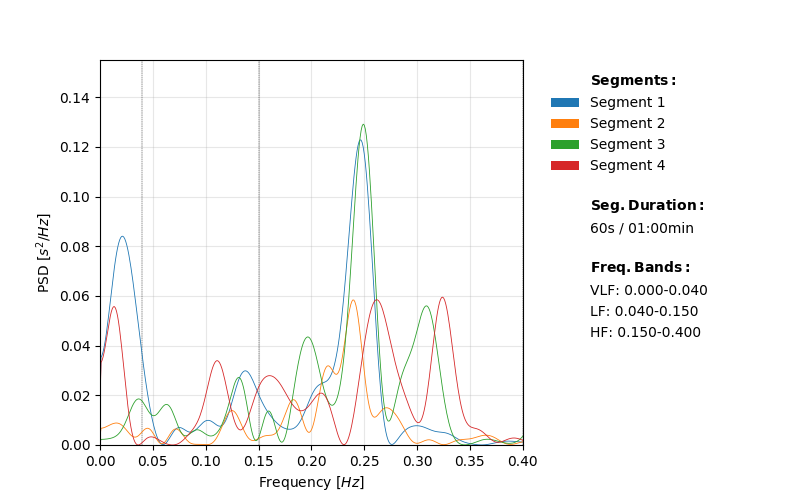
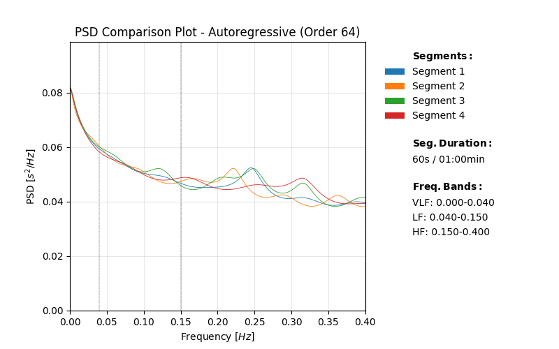
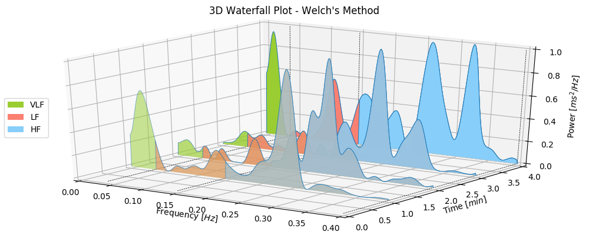
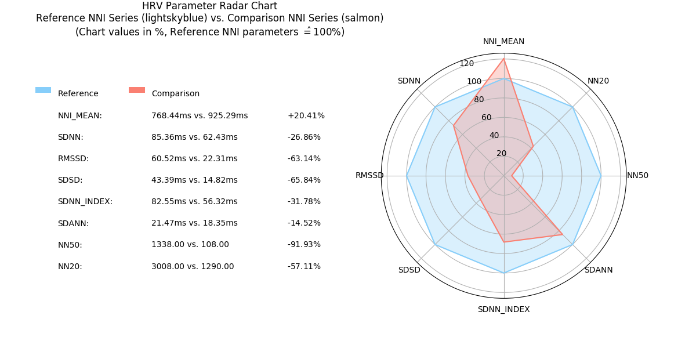

[](https://pypi.org/project/pyhrv/)

[](https://github.com/PGomes92/pyhrv/issues)

[](https://pyhrv.readthedocs.io/en/latest/)


pyHRV is an open-source Python toolbox that computes state-of-the-art Heart Rate Variability (HRV) parameters from Electrocardiography (ECG), SpO2, Blood Volume Pulse (BVP), or other signals with heart rate indicators.

With pyHRV, we aim to provide a user-friendly and versatile Python toolbox for HRV dedicated education, research, and application development.

It provides provides comprehensible source code to help beginners understand the fundamentals of HRV parameter computation, while providing the most important HRV analysis functionalities for developers and publication-quality plots of the results for researchers.
# Getting Started

### Installation & Python Compatibility
This toolbox can be installed using the ```pip``` tool.

```python
pip install pyhrv
```
Dependencies: [biosppy](https://github.com/PIA-Group/BioSPPy) | [numpy](http://www.numpy.org) | [scipy](http://scipy.org) | [matplotlib](https://matplotlib.org) | [nolds](https://github.com/CSchoel/nolds) | [spectrum](https://github.com/cokelaer/spectrum)

pyHRV is primarily maintained in Python 3.X but has been tested under Python 2.7 up to version 0.4.0.


### Documentation & Tutorials
Detailed pyHRV documentation is available on ReadTheDocs:

[pyHRV API Reference](https://pyhrv.readthedocs.io)

Additional tutorials can be found here:

- [pyHRV Quickstart Guide](./pyhrv/README.md)

- [Tutorial: From ECG acquisition to HRV analysis with pyHRV](https://pyhrv.readthedocs.io/en/latest/_pages/tutorials/bitalino.html)

- [Tutorial: Bulk processing with pyHRV](https://pyhrv.readthedocs.io/en/latest/_pages/tutorials/bulk.html)

### Scientific Background
The HRV algorithms have been developed and implemented according to the [Heart Rate Variability - Sandards of 
Measurement, Physiological Interpretation, and Clinical Use Guidelines](https://www.ahajournals.org/doi/full/10.1161/01.CIR.93.5.1043). Other references are noted in the code and in the [pyHRV references](./pyhrv/files/references.txt).

### Citing pyHRV
Please use the following conference paper to cite pyHRV in your work ([Conference Paper [PDF]](https://drive.google.com/open?id=1enItjdVXkTYX_h2DkgDl2v8vXAe09QJv), [Conference Proceedings [PDF]](https://etran.rs/2019/Proceedings_IcETRAN_ETRAN_2019.pdf)):

*P. Gomes, P. Margaritoff, and H. P. da Silva, “pyHRV: Development and evaluation of an open-source python toolbox for
 heart rate variability (HRV),” in Proc. Int’l Conf. on Electrical, Electronic and Computing Engineering (IcETRAN), pp. 822-828, 2019*

```latex
@inproceedings{Gomes2019,
   author = {Gomes, Pedro and Margaritoff, Petra and Silva, Hugo},
   booktitle = {Proc. Int'l Conf. on Electrical, Electronic and Computing Engineering (IcETRAN)},
   pages = {822-828},
   title = {{pyHRV: Development and evaluation of an open-source python toolbox for heart rate variability (HRV)}},
   year = {2019}
}
```

# pyHRV Core Features & HRV Parameter List

With pyHRV, you can compute up to 78 HRV parameters while using other useful non-parameter-specific tools to support 
your HRV research.

### Time Domain Parameters

- Basic statistical parameters of a NNI series - ```pyhrv.time_domain.nni_parameters()``` 
- Basic statistical parameters of a ΔNNI series - ```pyhrv.time_domain.nni_differences_parameters()```
- Basic statistical parameters of a Heart Rate (HR) series - ```pyhrv.time_domain.hr_parameters()``` 
- Standard deviation of a NNI series (SDNN) - ```pyhrv.time_domain.sdnn()``` 
- Mean of the SDNN of 5 successive 5 minute segments extracted from long-term NNI series (SDNN<sub>index</sub>)- ```pyhrv.time_domain.sdnn_index()``` 
- Standard deviation of the mean of 5 minute segments extracted from long-term NNI series (SDANN) - ```pyhrv.time_domain.sdann()``` 
- Root mean square of successive difference (RMSSD) - ```pyhrv.time_domain.rmssd()``` 
- Standard deviation of successive differences (SDSD) - ```pyhrv.time_domain.sdsd()``` 
- NNx & pNNx parameters - ```pyhrv.time_domain.nnXX()``` 
- NN20 & pNN20 parameters - ```pyhrv.time_domain.nn20()``` 
- NN50 & pNN50 parameters - ```pyhrv.time_domain.nn50()``` 
- Triangular Index (Maximum of the Histogram / Width of the Histogram) - ```pyhrv.time_domain.triangular_index()``` 
- Triangular Interpolation Function (TINN)<sup>1</sup> - ```pyhrv.time_domain.tinn()```

<sup><sup>1</sup> the current version of pyHRV has some bug which causes misleading and false results for the TINN 
function. [An issue has already been opened for this purpose...](https://github.com/PGomes92/pyhrv/issues/5)


### Frequency Domain Parameters
Computes the following Frequency Domain parameters from the Power Spectral Density (PSD) of a NNI series computed 
using the following PSD methods:

- Welch's Method - ```pyhrv.frequency_domain.welch_psd()```
- Autoregressive - ```pyhrv.frequency_domain.ar_psd()```
- Lomb-Scargle - ```pyhrv.frequency_domain.lomb_psd()```

Frequency parameters:
- Peak Frequencies
- Absolute Powers
- Logarithmic Powers
- Relative Powers
- Normalized Powers (LF and HF only)
- LF/HF ratio

The parameters are computed for the Very Low Frequency (VLF), Low Frequency (LF), and High Frequency (HF) bands. The 
Frequency Bands can be customized, including an Ultra Low Frequency (ULF) band.

Sample plots of the resulting PSD plots and Frequency Domain parameters using pyHRV can be seen below:


#### PSD Comparison Features - 2D Comparison Plot
Plot PSDs from multiple NNI segments extracted from a NNI series (e.g. 5 minute segments of a 60 minute recording) in a 3D Waterfall Plot using the Welch, Autoregressive or Lomb-Scargle method and compute the Frequency Domain parameters from each segment - ```pyhrv.frequency_domain.psd_comparison()``` [[source](https://github.com/PGomes92/pyhrv/blob/b5c5baaa8bf1ad085dc2dfe46b477171fe153682/pyhrv/frequency_domain.py#L970)].





#### PSD Comparison Features - 3D Waterfall Plot
Plot PSDs from multiple NNI segments extracted from a NNI series (e.g. 5 minute segments of a 60 minute recording) in a single plot using the Welch, Autoregressive or Lomb-Scargle method and compute the Frequency Domain parameters from each segment - ```pyhrv.frequency_domain.psd_waterfall()```




## Nonlinear Parameters
Computes the following Nonlinear Parameters and the respective plots:

- Poincaré Plot (SD1, SD2, fittes ellipse area, SD2/SD1 ratio) - ```pyhrv.nonlinear.poincare()```
- Sample Entropy - ```pyhrv.nonlinear.sample_entropy()```
- Detrended Fluctuation Analysis (short-term and long-term)- ```pyhrv.nonlinear.dfa()```


## HRV Support Tools & Other Features

- Computation of NNI series - ```pyhrv.tools.nn_intervals()``` 
- Computation of ∆NNI series - ```pyhrv.tools.nn_diff()```
- Computation of HR series - ```pyhrv.tools.heart_rate()``` 
- ECG plotting on medical-grade-like ECG paper layout - ```pyhrv.tools.plot_ecg()``` 
- NNI Tachogram plotting - ```pyhrv.tools.tachogram()```
- Heart Rate Heatplot, a visualization & classification of HR performance based on normal HR ranges by age and gender- ```pyhrv.tools.heart_rate_heatplot()```
- Time varying plot of a HRV parameter over time - ```pyhrv.tools.time_varying()```
- Dynamic Radar chart of HRV parameters - ```pyhrv.tools.radar_chart()```
- Exporting HRV results into a JSON file [Sample File](./pyhrv/files/SampleExport.json)- ```pyhrv.tools.hrv_export()``` 




## HRV Reports
Generate HRV reports in .TXT, .CSV, and .PDF format (new in v.0.4!). Read the [README](./pyhrv/report/README.md) file of the pyHRV report submodule for more information about how to generate pyHRV reports as the following:

- [pyHRV .TXT report](./pyhrv/files/SampleReport.txt)
- [pyHRV .CSV report](./pyhrv/files/SampleReport.csv)
- [pyHRV .PDF report](./pyhrv/files/SampleReport.pdf)


## Utilities
Several non-HRV specific utilities and general purpose functions which are used throughout this toolbox:
- Loading NNI sample series for testing purposes - ```pyhrv.utils.load_sample_nni()```
- Loading pyHRV's [hrv_keys.json](./pyhrv/files/hrv_keys.json) file - ```pyhrv.utils.load_hrv_keys_json()```
- Format NNI series (ensure numpy array and convert data provided in seconds to ms - ```pyhrv.utils.nn_format()```
- Segmentation of time series (e.g. NNI series) - ```pyhrv.utils.segmentation()```
- and others...

# Disclaimer
This program is distributed in the hope it will be useful and provided to you "as is", but WITHOUT ANY WARRANTY, without even the implied warranty of MERCHANTABILITY or FITNESS FOR A PARTICULAR PURPOSE. This program is NOT intended for medical diagnosis. We expressly disclaim any liability whatsoever for any direct, indirect, consequential, incidental or special damages, including, without limitation, lost revenues, lost profits, losses resulting from business interruption or loss of data, regardless of the form of action or legal theory under which the liability may be asserted, even if advised of the possibility of such damages.

This package has initially (up to version 0.3) been developed within the scope of my master thesis _"Development of an 
Open-Source Python Toolbox for Heart Rate Variability (HRV)"_ at the [University of Applied Sciences Hamburg, Germany (Faculty Life Sciences, Department of Biomedical Engineering)](https://www.haw-hamburg.de/fakultaeten-und-departments/ls/studium-und-lehre/master-studiengaenge/mbme.html) and [PLUX wireless biosignals, S.A.](http://www.plux.info), Lisbon, Portugal.