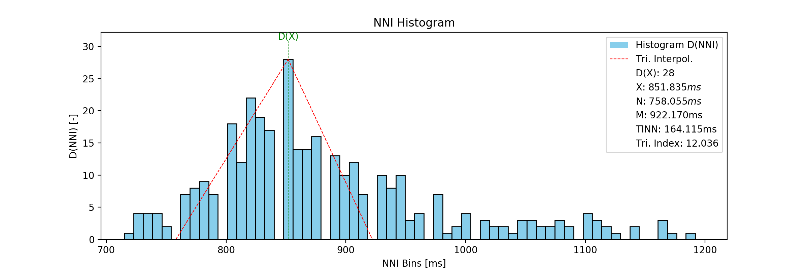
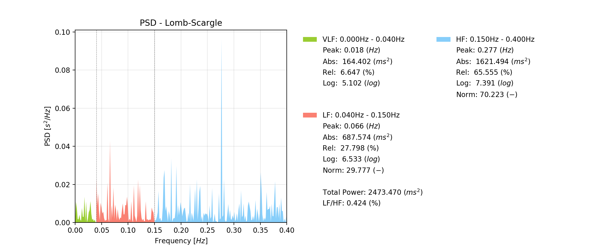
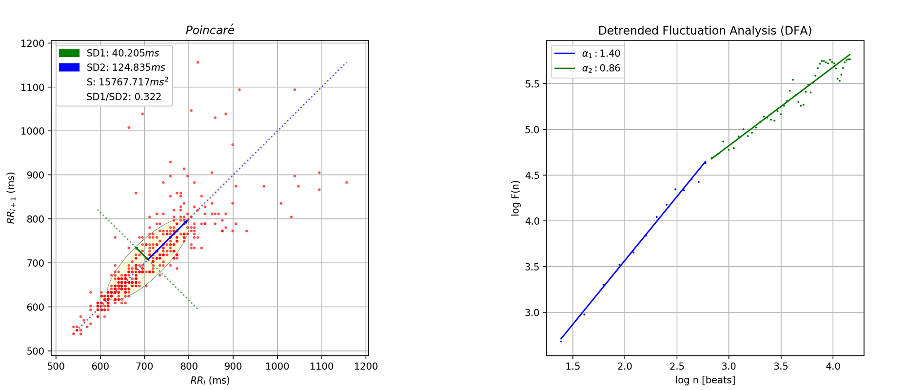

This repository contains the HRV toolbox (Python package) developed within the scope of my master thesis *"Development of an Open-Source Python Toolbox for Heart Rate Variability (HRV)"*).

The HRV algorithms have been developed and implemented according to the [Heart Rate Variability - Sandards of Measurement, Physiological Interpretation, and Clinical Use](http://circ.ahajournals.org/content/93/5/1043) guidelines and other references which are notes in the code itself (will be entirely updated soon).

Below follows as list of the parameters and features. Major updates will be listed in the [changelog](changelog.md).

## Getting Started

### Installation
This package can be installed using the ```pip``` tool:
```python
pip install pyhrv
```

The current pyHRV has been primarily developed for the Python 2.7 programming language. Running the pip command above may cause
errors when trying to install the package using Python 3. In this case, try to install the pyHRV dependencies first:

```python
pip install biosppy
pip install matplotlib
pip install numpy
pip install scipy
pip install nolds
pip install spectrum
pip install pyhrv
```

### Documentation & Tutorials
An overview of all the available functions and short quickstart tutorials can be found in the [README](./pyhrv/README.md) file found within the `pyhrv` package.

The official **pyHRV** Documentation is now available on ReadTheDocs:

https://pyhrv.readthedocs.io

## HRV Parameter List

The following HRV parameters can be computed with this toolbox. 

(NNI: Normal-to-Normal Interval, HR: Heart Rate, SD: Standard deviation, PSD: Power Spectral Density)

### Time Domain Parameters
- Basic statistical parameters of an NNI series (min, max, mean)
- Basic statistical parameters of an NNI differences series (min, max, mean, max difference)
- Basic statistical parameters of an HR series (min, max, mean, SD)
- Standard Deviation of NNI (SDNN)
- Mean of the SD of 5min segments (SDNN Index)
- SD of the Mean of 5min segments (SDANN)
- Root Mean Square of Successive Differences (RMSSD)
- SD of Successive Differences (SDSD)
- NN50 (NNI > 50ms) and pNN50 (% of NNI > 50ms)
- NNX (NNI > Xms) and pNN50 (% of NNI > Xms)
- Triangular Index
- Baseline Width of the Histogram based on Triangular Interpolation (TINN) (TINN, N, M)

### Frequency Domain Parameters
Computes the following PSD parameters from the Welch's Method and the Lomb-Scargle periodogram (with default or custom frequency bands):
- Peak Frequencies
- Absolute Powers
- Logarithmic Powers
- Relative Powers
- Normalized Powers (LF and HF only)
- LF/HF ratio

### Nonlinear Parameters
- Poincaré Plot (SD1, SD2, fittes ellipse area, SD2/SD1 ratio)
- Sample Entropy
- Detrended Fluctuation Analysis (short-term and long-term)

### Additional HRV Tools
- Computation of NNI series
- Computation of ∆NNI series
- Computation of HR series
- Signal segmentation
- ECG plotting on medical-grade-like ECG paper layout
- Tachogram plotting
- HRV report generation (.txt and .csv format)
- HRV result exportation and importion (.json format)

## Sample Figures
### ECG Plot


### Tachogram


### Histogram & Geometrical Parameters


### Frequency Domain - Welch's Periodogram


### Frequency Domain - Lomb-Scargle Periodogram


### Frequency Domain - Autoregressive Method


### Nonlinear - Poincaré & Detrended Fluctuation Analysis


## Dependencies
- [biosppy](https://github.com/PIA-Group/BioSPPy)
- [numpy](http://www.numpy.org)
- [scipy](http://scipy.org)
- [matplotlib](https://matplotlib.org)
- [nolds](https://github.com/CSchoel/nolds)
- [spectrum](https://github.com/cokelaer/spectrum)

## Context of this Work
This package has initially been developed within the scope of my master thesis _"Development of an Open-Source Python Toolbox for Heart Rate Variability (HRV)"_ at the [University of Applied Sciences Hamburg, Germany (Faculty Life Sciences, Department of Biomedical Engineering)](https://www.haw-hamburg.de/fakultaeten-und-departments/ls/studium-und-lehre/master-studiengaenge/mbme.html) and [PLUX wireless biosignals, S.A.](http://www.plux.info), Lisbon, Portugal.

## Other Support Packages Developed within the Skope of this Work
### OpenSignalsReader
Python package to read [OpenSignals (r)evolution](http://bitalino.com/en/software) files and automatic sensor data conversion for [BITalino (r)evolution](http://bitalino.com) sensor data.

This package has been developed to facilitate the import of ECG sensor data acquired with BITalino (r)evolution to conduct HRV analysis.

Visit the repository for more detailed information:

https://github.com/PGomes92/opensignalsreader

_([OpenSignals (r)evolution](http://bitalino.com/en/software) (by [PLUX wireless biosignals S.A.](http://plux.info)) is the official software for the [BITalino](http://bitalino.com) and [biosignalsplux](http://biosignalsplux.com) biosignal acquisition platforms._)

### KUBIOS
Python package to export NN/RR interval series in [KUBIOS HRV](https://www.kubios.com) readable format and to import HRV results from KUBIOS report files in .txt format.

Visit the repository for more detailed information:

https://github.com/PGomes92/kubios

## Citing
Please use the citation format below if you need to cite this package in any of your work:

- Gomes P, Silva H, Margaritoff P, **pyHRV - Open-Source Python Toolbox for Heart Rate Variability**, 2018-,
  https://github.com/PGomes92/hrv-toolkit/ [Online; accessed ```<year>-<month>-<day>```].

```latex
@Misc{,
  author = {Pedro Gomes, Hugo Silva, Petra Margaritoff},
  title = {{pyHRV} - Open-Source Python Toolbox for Heart Rate Variability},
  year = {2018--},
  url = "https://github.com/PGomes92/hrv-toolkit/",
  note = {[Online; accessed <today>]}
}
```

## Repository Structure Info
    .
    ├── pyhrv                           # HRV toolbox/package (where the magic happens)
    |   └──files                        # Sample files & HRV keys
    |   |   ├── hrv_keys.json           # HRV keys to access the parameter results stored in
    |   |   |                           # biosspy.utils.ReturnTuple objects & parameter labels
    |   |   ├── SampleExport.json       # Sample export file generated with pyhrv.tools.hrv_export()
    |   |   ├── SampleReport.txt        # Sample export file generated with pyhrv.tools.hrv_report()
    |   |   └── SampleECG.txt           # BITalino (r)evolution sample ECG acquistion
    |   |
    |   ├── samples                     # 50 sample NNI series
    |   |
    |   ├── README.md                   # Package overview & quick start guide/examples
    |   ├── references.txt              # References used in the in-code documentation
    |   ├── __init__.py                 # Package initialitation file
    |   ├── __version__.py              # Package version file
    |   ├── tools.py                    # HRV tools (nni, segmentation, reports, ...)
    |   ├── hrv.py                      # HRV package level function
    |   ├── time_domain.py              # Time domain parameter functions
    |   ├── frequency_domain.py         # Frequency domain parameter functions
    |   └── noninear.py                 # Nonlinear parameter functions
    |
    ├── SampleFigures                   # Sample figures of plots
    |   └──readmefigures                # readmefigures
    ├── changelog.md                    # Changelog
    ├── LICENSE.txt                     # License information
    └── README.py                       # <- you are here

## Disclaimer
This program is distributed in the hope it will be useful and provided to you "as is", but WITHOUT ANY WARRANTY, without even the implied warranty of MERCHANTABILITY or FITNESS FOR A PARTICULAR PURPOSE. This program is NOT intended for medical diagnosis. We expressly disclaim any liability whatsoever for any direct, indirect, consequential, incidental or special damages, including, without limitation, lost revenues, lost profits, losses resulting from business interruption or loss of data, regardless of the form of action or legal theory under which the liability may be asserted, even if advised of the possibility of such damages.
